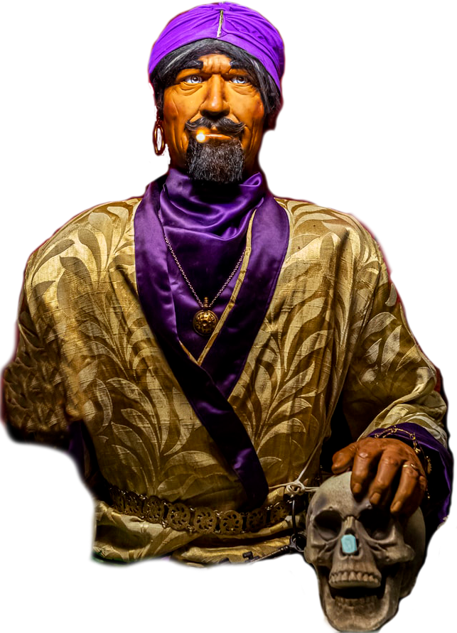
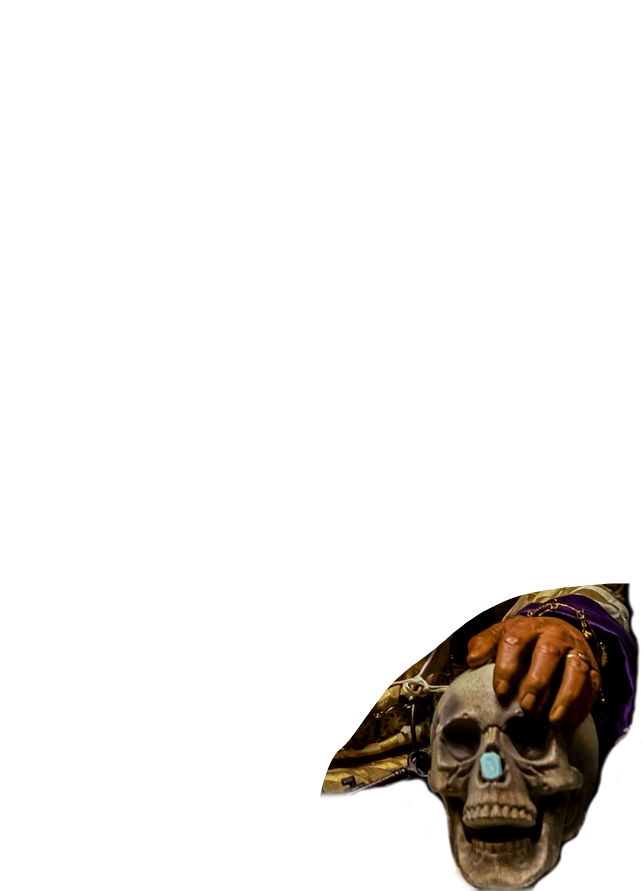
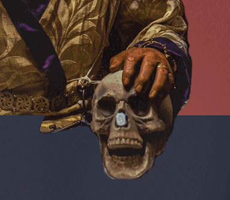
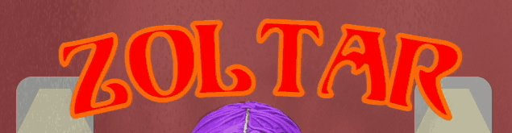
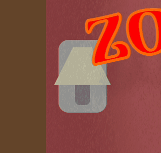
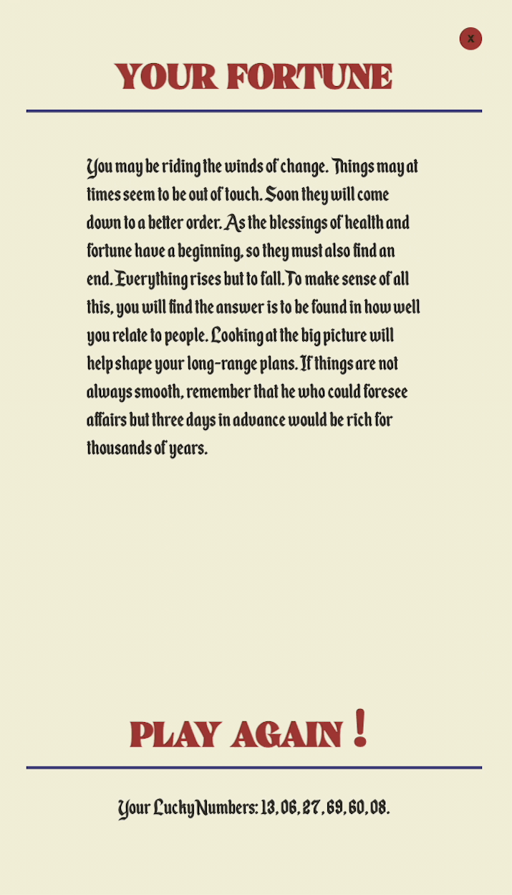

<!-- PROJECT LOGO -->

ZOLTAR

<h1 align="center">Zoltar - Online Fortune Teller</h1>
  

   This project was inspired by the old fortune teller machines that gives you a random fortune.
     
    <a href="https://linktowebsite.com">View Live Demo</a>

<!-- TABLE OF CONTENTS -->

  
Table of Contents

  <ol>
    <li>
      <a href="#about-the-project">About The Project</a>
      <ul>
      <li><a href="#built-with">Built With</a></li>
      </ul>
      <li><a href="#design">Design</a></li>
      <ul>
      <li><a>Zoltar</a></li>
      <li><a>Booth & Background</a></li>
      <ul>
      <li><a>Zoltar Text</a></li>
      <li><a>Lamps</a></li>
      <li><a>Crystal Ball</a></li>
      <li><a>Coins</a></li>
      </ul>
      <li><a>Fortune Card</a></li>
      </ul>
    </li>
    <li><a href="#usage">Usage</a></li>
    <li><a href="#contact">Contact</a></li>
  </ol>

<!-- ABOUT THE PROJECT -->
## About The Project

For this project i used Vanilla JS so i could fully master and understand what it has to offer, I created this based off of the real Fortune Teller machines you would find in a arcade. Using Zoltar which originated in the movie "Big" as the face of the project.

I then manipulate the DOM to place a random fortune after Zoltar has spoken wisdom, which is randomized and played using [Howler](howler.link) The random fortunes come from an array and generates a unique set of lucky numbers for each fortune.

 

## Built With
 - Javascript
 - CSS
 
 

## Design

### Zoltar

For making Zoltar i wanted to use all CSS, but allowed myself to use a image for the main Image.
 
I cut the Zoltar image into 3 layers. (the body, and both hands).
 

I cut them this way so i can animate his right hand with css over the crystal ball and place his other hand over a css made table using `z-index` to create more depth in the 2D image.

 

### Booth & Background
####  **Zoltar Text**
For the text i used a JS library to help with the curve that the fortune telling machines usually have. i Chose *insert library name here* which is a text curving library to solve this issue.

#### **Lamps**
For the lamps i created 3 divs and shaped them with CSS into what resembles a lamp, i then created another div with a yellow `box-shadow` under the lamps that fades in and out with the color change in the lamp shades.
 

The CSS animation changes the background color of the lamp shades, as well as the background lights opacity changing with the shades.

 

### Fortune Card

For the card i used pure CSS and added in web-fonts to get as close as possible to the classic look of the card

Fonts used:
- **Reikna** *(for the headers)*
- **Enchanted Land** *(for the body)*
 

<!-- USAGE EXAMPLES -->

 

## Usage

Open Zoltar when you're facing troubles, open Zoltar when you're curious. Get fortunes *(without the quarters!)*
 
 

<!-- CONTACT -->
## Contact

**John Farina** - johnfarina8@gmail.com

Project Link: [github.com/john-farina/Zoltar](https://github.com/john-farina/Zoltar)

(<a href="#readme-top">back to top</a>)

